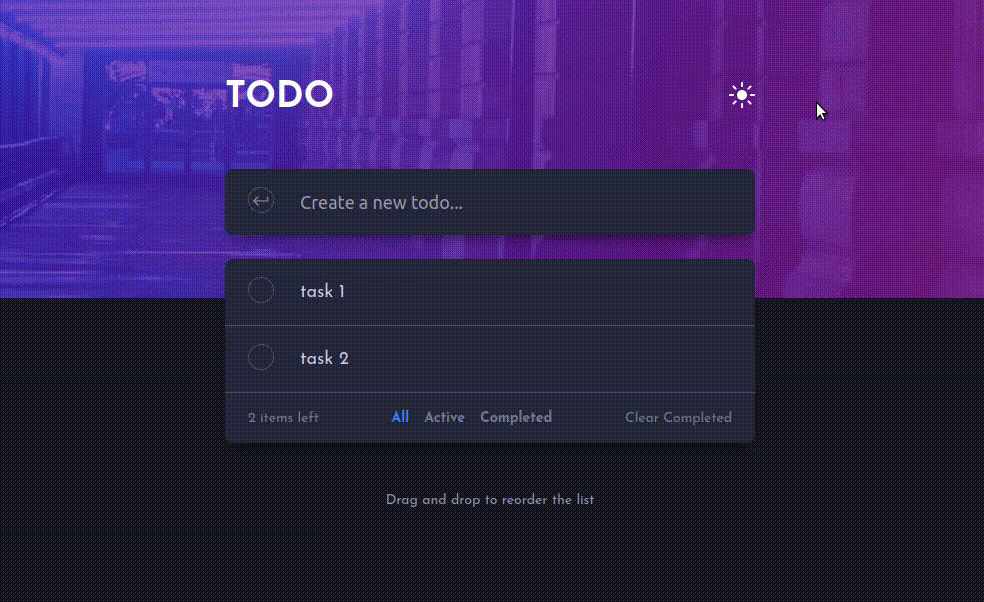

# React Todo App

This is classic todo app built with ReactJS with a few twists! This app includes a dark/light theme toggle and drag & drop reordering. this is a challenge from [frontendmentor](https://www.frontendmentor.io/challenges/todo-app-Su1_KokOW).

## Live Link

In the following link, you can view the [App](https://todolist-react-app.herokuapp.com/).

## Getting Started

start by cloning the repository.

`git clone https://github.com/rachidelaid/react-todolist.git`

cd to the folder.

`cd react-todolist`

install all the dependencies.

`npm install`

run the live server

`npm run start`

go to [http://localhost:8080](http://localhost:3000)

build the distribution folder before hosting the app

## Authors

👤 **Rachid El aid**

- GitHub: [@rachidelaid](https://github.com/rachidelaid)
- Twitter: [@rachidelaid1](https://twitter.com/rachidelaid1)
- LinkedIn: [Rachid El aid](https://www.linkedin.com/in/rachid-elaid-106336203/)

## 🤝 Contributing

Contributions, issues, and feature requests are welcome!

Feel free to check the [issues page](../../issues/).

## Acknowledgments

Thank you [frontendmentor](https://www.frontendmentor.io/challenges/todo-app-Su1_KokOW) for the design.😊

## Show your support

Give a ⭐️ if you like this project!
